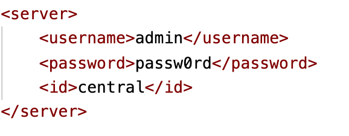
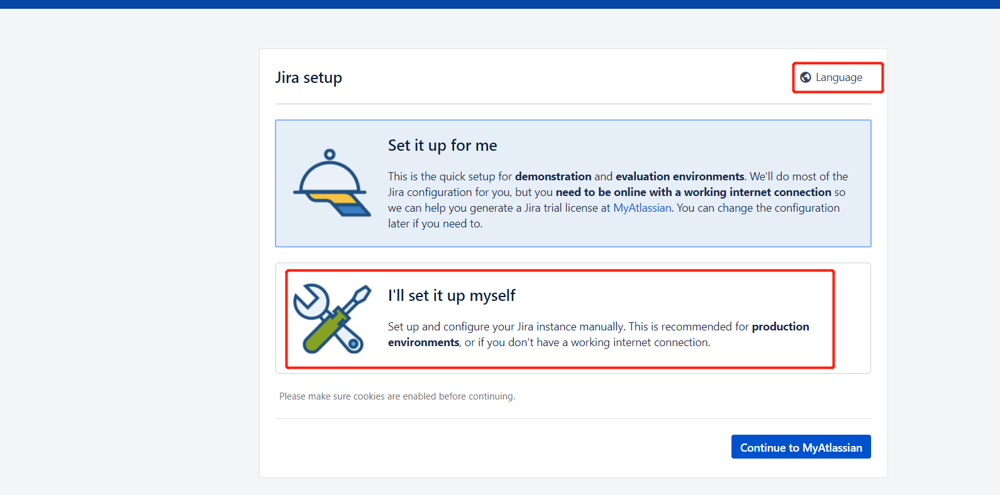
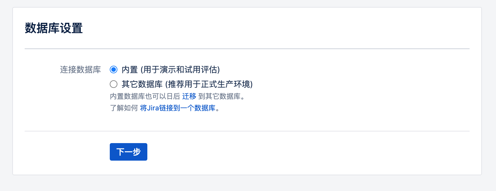
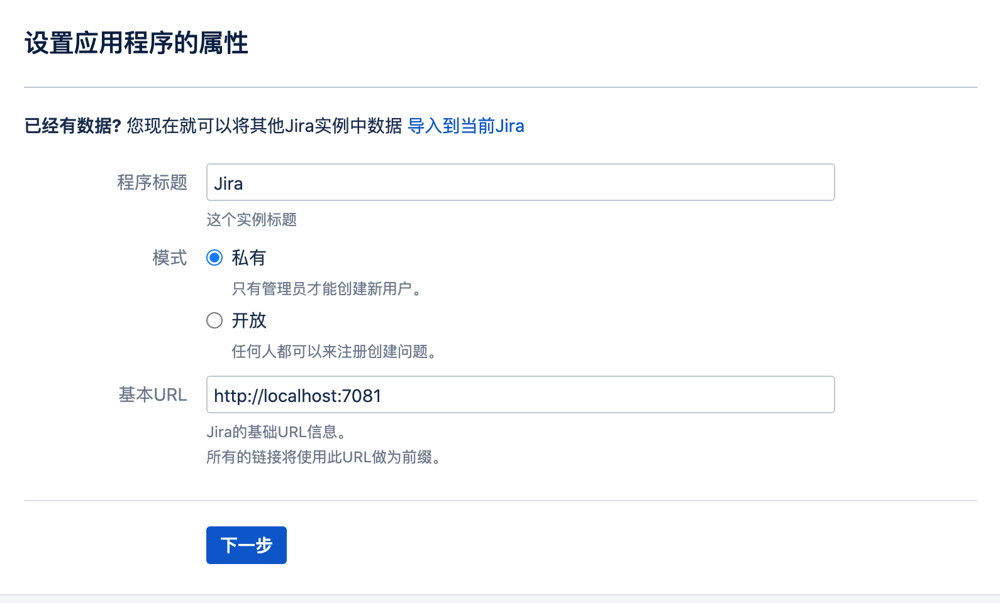
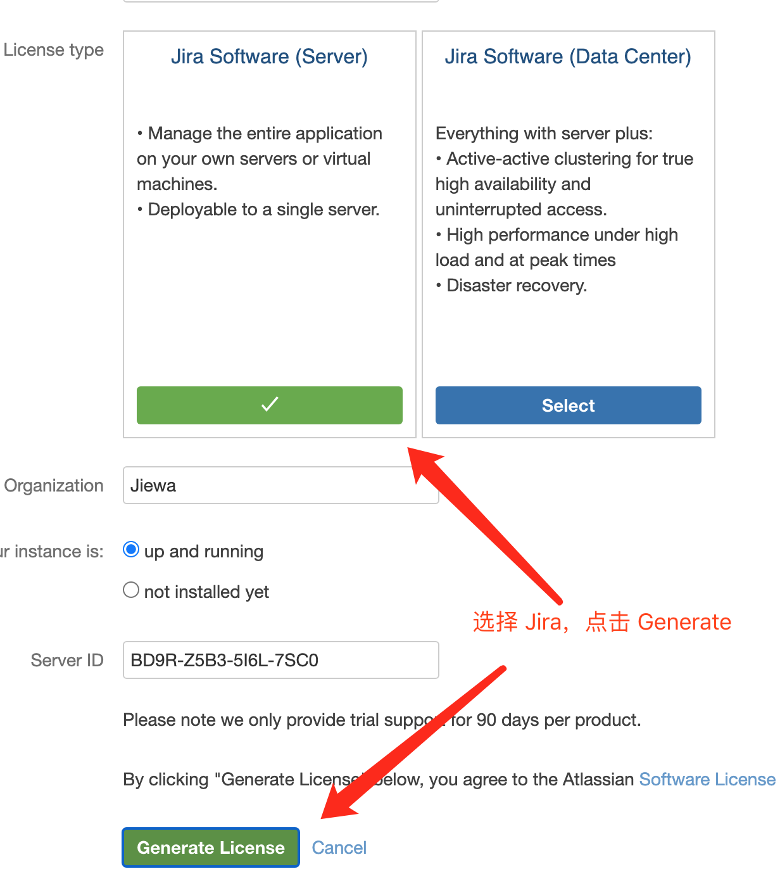

# 硬件环境
1 台8 核 16GB 内存机器，或者 2 台 4 核 8GB 内存机器。Linux,Mac 均可
笔者环境为 MacBook 8C 16GB。

# 部署方式 1：开发者环境部署：		

注意：本课程重点在于各个 DevOps 工具的串联，集成，从而落地一个企业级的持续交付流水线

## 1.1 配置本地开发环境Idea

## 搭建本地 Maven 仓库 Artifactory 开源版
注意：需要保证有足够的内存可用（2GB空闲内存）

```
docker run --name artifactory-oss-6.18.1 -d -v /Users/qing/JFROG_HOME/artifactory-oss-618:/var/opt/jfrog/artifactory  -p 8083:8081 registry.cn-beijing.aliyuncs.com/qingfeng666/artifactory-oss:6.18.1
```

如果拉取镜像拉不下来，可以通过从网盘下载，链接: https://pan.baidu.com/s/1zTh4-Jhd4OeV12IyfI_YPg  密码: 8bfc
然后执行：
```
docker load < artifactory-oss-6.18.1.tar

```
再运行上述 docker run 命令

## 1.2 一键编译打包 Java 项目
在代码根目录中执行命令：
```
mvn package
```

## mvn deploy 
在 Artifactory 仓库中右上角，选择'Set me up', 在弹出框中输入密码，并且点击"Generate Maven Settings".再点击"Generate Settings",点击"Download Snippet "，将下载好的 settings.xml 文件放置于 ~/.m2 目录下。
mvn deploy 需要校验 settings.xml 文件里的用户名和密码，如果使用加密的密码执行 mvn deploy报错，可以用明文密码如下所示：


注意：如果包名包含 -SNAPSHOT，默认无法部署到 Releas-local 仓库。修改包名去掉”-SNAPSHOT“即可部署。

## 1.3 本地运行 Java 项目	
在代码根目录中执行./runAll.sh，选择 Y


|  微服务   | 访问路径  |
|  ----  | ----  |
| Discovery Service | http://localhost:8761 |
| Notebook service  | http://localhost:2222/notebook/ |
| Gateway service  | http://localhost:8765/notebook/|
| Zipkin service  | http://localhost:9411 |
  

## 1.4 停止本地运行的 Java 项目
在代码根目录中执行./stopAll.sh

## 1.5 启动 zipkin 服务
```
docker run -d --name zipkin  -p 9411:9411 openzipkin/zipkin
```

## 部署 Selenium

```
docker run -d -p 4444:4444 -v /var/docker-mount/shm:/dev/shm selenium/standalone-chrome:3.141.59-20200409
```
注意：selenium 需要依赖 chrome 浏览器和 chromeDriver。
chromeDriver的版本需要和你的 chrome 浏览器版本一直，下载地址如下：
https://chromedriver.chromium.org/downloads


## 在 Centos7 系统上安装Docker
1. 添加基础软件
```
curl -o /etc/yum.repos.d/CentOS-Base.repo http://mirrors.aliyun.com/repo/Centos-7.repo
yum install -y yum-utils device-mapper-persistent-data lvm2 wget
```
2. 设置阿里云 Docker 的yum源
```
 wget https://mirrors.aliyun.com/docker-ce/linux/centos/docker-ce.repo -O /etc/yum.repos.d/docker-ce.repo
```

3. 查看仓库中所有Docker版本
```
yum list docker-ce --showduplicates | sort -r
```
　
4. 安装Docker
　　　
```
yum -y install docker-ce
```

5. 启动并加入开机启动
```
systemctl start docker
systemctl enable docker
```

## Docker 部署 Jira Server
1. 拉取镜像 docker pull registry.cn-beijing.aliyuncs.com/qingfeng666/jira-server:8.1.0
2. 创建挂载目录
mkdir -p /tmp/localtime
chmod -R 777 /tmp/localtime
3. Docker 运行 Jira Server
docker run -d -p 7081:8080 --name jira-software -v /tmp/localtime:/etc/localtime:ro registry.cn-beijing.aliyuncs.com/qingfeng666/jira-server:8.1.0
4. 配置 Jira
浏览器访问：http://localhost:7081/secure/SetupMode!default.jspa

选择内置数据库（适用于演示环境）：




## Docker 部署 sonarqube
注意：需要保证有足够的内存可用（2GB空闲内存）
```
docker pull library/sonarqube:7.9.3-community
docker run -d -p 9000:9000 sonarqube:7.9.3-community
```
访问：http://localhost:9000/
admin/admin

## 部署 YAPI
参考官网：https://hellosean1025.github.io/yapi/devops/index.html


# 部署方式 2： Kubernetes 部署

## 2.1 配置免费本地 Docker 镜像中心 JFrog Container Registry 
	
1. 创建$JFROG_HOME环境变量。
    
```
export $JFROG_HOME=/Users/qing/.jfrog/JFROG_HOME
```
2. 创建 JCR 工作目录	
```
mkdir ~/jfrog-home
export JFROG_HOME=~/jfrog-home

mkdir -p $JFROG_HOME/artifactory-jcr/var/etc/
cd $JFROG_HOME/artifactory-jcr/var/etc/
touch ./system.yaml
chown -R 777 $JFROG_HOME/artifactory-jcr/var
	
```
3. 启动镜像仓库 JCR

```
docker run -d -m 2000m --name  artifactory-jcr-v7  -v $JFROG_HOME/jcr/var:/var/opt/jfrog/artifactory -p 8081:8081 -p 8082:8082 registry.cn-beijing.aliyuncs.com/qingfeng666/artifactory-jcr:latest
```

4. 登录
```
docker login art.local:8081 -uadmin -ppassw0rd
```

5. 配置 docker 服务：
File sharing 增加:
```
/var/opt/jfrog/jcr
/var/jenkins_home
```
Insecure Registry：
```
art.local:8081
```

Registry Mirror:

`https://registry.docker-cn.com
 http://hub-mirror.c.163.com`


## 2.2 启动 Minikube
### Mac
```
curl -Lo minikube http://kubernetes.oss-cn-hangzhou.aliyuncs.com/minikube/releases/v0.30.0/minikube-darwin-amd64 && chmod +x minikube && sudo mv minikube /usr/local/bin/
```
### Linux
```
curl -Lo minikube http://kubernetes.oss-cn-hangzhou.aliyuncs.com/minikube/releases/v0.30.0/minikube-linux-amd64 && chmod +x minikube && sudo mv minikube /usr/local/bin/

`minikube start --cpus 4 --memory 8192`
```
配置本地镜像中心域名
```
minikube ssh
su
sudo echo "192.168.100.178 art.local zipkin-server" >> /etc/hosts
```
Add insecure registry for minikube:
	~/.minikube/machines/minikube/config.json

```
"InsecureRegistry": [
                "10.96.0.0/12",
                "art.local"
            ],
```
## 2.3 创建Kubernetes镜像秘钥
dev namespace秘钥:
```
kubectl create secret docker-registry regcred-local --docker-server=art.local:8081 --docker-username=admin --docker-password=passw0rd --docker-email=wq237wq@gmail.com -n dev
```		

prod namespace秘钥：
```
kubectl create secret docker-registry regcred-local --docker-server=art.local:8081 --docker-username=admin --docker-password=passw0rd --docker-email=wq@gmail.com -n prod
```

## 2.4 构建并推送镜像
构建所有服务的镜像，并推送到镜像仓库：./updateImages.sh


## 2.5

部署服务到 Kubernetes： ./runAll.sh，选择 N
微服务访问

  
|  微服务   | 访问路径  |
|  ----  | ----  |
| Discovery Service | http://{minikube ip}:31002 |
| Notebook service  | http://{minikube ip}:30222/notebook/ |
| Gateway service  | http://{minikube ip}:30333/notebook/|
| Zipkin service  | http://{minikube ip}:30411 |
  


		
​			
# Helm部署

## 运行

notebook部署：
```
cd /Notebook-k8s/Final/k8s-deploy/charts/notebook
helm install -f values.yaml notebook ./ 
```
## 打包
``` 
helm package discovery 
```
## 上传到 Artifactory
```
curl -uadmin:AP2QTvXi6JebDJshpPaGheD3nE1 -T 	~/code/notebook-k8s/kube-deploy/charts/notebook-0.1.1.tgz "http://localhost:8081/artifactory/helm/notebook-	0.1.1.tgz"
```
## 删除Helm Chart
```
helm del discovery
```
# Jenkins 流水线
```
java -jar /Users/qing/Documents/server/apache-tomcat-8.5.35/webapps/jenkins.war
```
## Docker 启动 Jenkins
创建本地目录/var/jenkins_home，用于 Jenkins 容器的数据持久化
```
docker run --name jenkins -p 8080:8080 -p 50000:50000 -v /var/jenkins_home:/var/jenkins_home jenkins/jenkins:lts
```

## 配置 Jenkins 的 mvn 路径
在 Jenkins 里选择Manage Jenkins -> Global Tool Configuration
点击Add Maven，可以执行一个已经下载好的 maven 路径，也可以让系统自动安装 Maven


## 创建用户名和密码：
admin/passw0rd

## 本地访问
localhost:8080

## 安装插件
Pipeline
Git
Artifactory

## 流水线脚本
在 Jenkins 里需要设定 maven 的执行路径，并且制定名称，例如第六章流水线脚本里引用的 maven 名字如下：
rtMaven.tool = 'maven' // 名字与Jenkins configuration里的 maven 名称保持一致


# FAQ

## Install/Update Minikube 

如需更新minikube，需要更新 minikube 安装包

` minikube delete` 
`删除现有VirtualBox虚机`
`删除 ~/.minikube 目录缓存的文件`
重新创建 minikube 环境

### Mac
```
curl -Lo minikube http://kubernetes.oss-cn-hangzhou.aliyuncs.com/minikube/releases/v0.30.0/minikube-darwin-amd64 && chmod +x minikube && sudo mv minikube /usr/local/bin/
```

### Linux
```
curl -Lo minikube http://kubernetes.oss-cn-hangzhou.aliyuncs.com/minikube/releases/v0.30.0/minikube-linux-amd64 && chmod +x minikube && sudo mv minikube /usr/local/bin/

minikube start --registry-mirror=https://registry.docker-cn.com

```